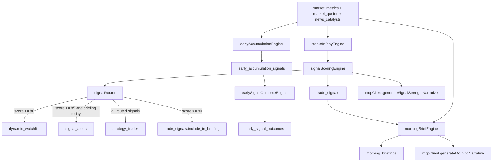

# OPENRANGE SYSTEM AUDIT

Date: 2026-03-09
Scope: Full read-only diagnostic audit of OpenRange signal intelligence architecture

## Executive Summary

Overall status: **Partially healthy with critical consistency gaps**.

What is working:
- Core signal scoring pipeline exists end-to-end in code (`stocksInPlayEngine -> signalScoringEngine -> signalRouter`).
- Required tables are present in the DB.
- Early accumulation detection and outcome tracking are implemented and populated.
- MCP narrative generation path exists and `trade_signals.narrative` is populated.
- Several required API endpoints return successful responses.

Critical issues:
- `signal_alerts` and `dynamic_watchlist` route endpoints are shadowed by another `/api/signals/:symbol` route and return 404 for `watchlist`/`alerts`.
- Signal component values (`float_rotation`, `liquidity_surge`, `catalyst_score`, `sector_score`, `confirmation_score`) are **all NULL** in `trade_signals`, despite existing score breakdown JSON.
- Market data completeness is poor for key inputs: `float_shares` and `atr_percent` are null/zero across all `market_metrics` rows.
- `stocksInPlayEngine` runtime measured at ~71.23s (>10s threshold).
- `stocksInPlayEngine` is not clearly scheduled in `startEngines.js`.

---

## Step 1 - Project Structure Audit

### Required folders
- `server/`: present
- `server/engines/`: present
- `server/routes/`: present
- `server/system/`: present
- `server/services/`: present
- `client/src/pages/`: present
- `client/src/components/`: present
- `client/src/utils/`: present

### Engine presence check
Required engines found:
- `stocksInPlayEngine.js`: present
- `catalystEngine.js`: present
- `liquiditySurgeEngine.js`: present
- `floatRotationEngine.js`: present
- `signalConfirmationEngine.js`: present
- `signalScoringEngine.js`: present
- `earlyAccumulationEngine.js`: present
- `earlySignalOutcomeEngine.js`: present
- `morningBriefEngine.js`: present
- `intelNarrativeEngine.js`: present

Missing required engines: none.

Potential duplicates / overlap risks:
- `server/engines/morningBriefEngine.js` and `server/engines/morningBriefingEngine.js`
- `server/engines/narrativeEngine.js`, `server/engines/signalNarrativeEngine.js`, `server/engines/mcpNarrativeEngine.js`, `server/engines/intelNarrativeEngine.js`
- Frontend duplicate-named components:
  - `client/src/components/opportunity/OpportunityStream.jsx` (appears unused)
  - `client/src/components/opportunities/OpportunityStream.jsx` (actively used)

---

## Step 2 - Database Schema Audit

### Required tables
All requested tables are present:
- `trade_signals`
- `dynamic_watchlist`
- `signal_alerts`
- `market_metrics`
- `news_articles`
- `news_catalysts`
- `early_accumulation_signals`
- `early_signal_outcomes`
- `strategy_trades`
- `morning_briefings`

### Column verification

#### `trade_signals` required columns
Required set:
- `symbol`, `score`, `confidence`, `score_breakdown`, `narrative`, `float_rotation`, `liquidity_surge`, `catalyst_score`, `sector_score`, `confirmation_score`, `created_at`

Result:
- All required columns exist.
- Data quality gap: all 20 rows have NULL for `float_rotation`, `liquidity_surge`, `catalyst_score`, `sector_score`, `confirmation_score`.

#### `dynamic_watchlist` required columns
Required set:
- `symbol`, `score`, `confidence`, `catalyst_type`, `sector`, `float_rotation`, `liquidity_surge`, `created_at`

Result:
- All required columns exist.
- Data quality gap: all 2 rows have NULL for `catalyst_type`, `sector`, `float_rotation`, `liquidity_surge`.

#### `signal_alerts` required columns
Required set:
- `symbol`, `score`, `confidence`, `alert_type`, `message`, `created_at`, `acknowledged`

Result:
- All required columns exist.
- Table currently has 0 rows.

#### `early_accumulation_signals` required columns
Required set:
- `symbol`, `price`, `volume`, `relative_volume`, `float_rotation`, `liquidity_surge`, `accumulation_score`, `pressure_level`, `detected_at`

Result:
- All required columns exist.
- Current dataset (19 rows) has 0 NULLs on required fields.

---

## Step 3 - Signal Pipeline Audit

Expected pipeline:
1. `stocksInPlayEngine`
2. `signalScoringEngine`
3. `signalRouter`
4. DB outputs (`dynamic_watchlist`, `signal_alerts`, `strategy_trades`)

### Wiring validation
Confirmed in code:
- `stocksInPlayEngine` calls `scoreSignal(...)`, then `routeSignal(...)`.
- `routeSignal(...)` writes to:
  - `dynamic_watchlist` for score >= 80
  - `trade_signals.include_in_briefing` flag for score >= 90
  - `signal_alerts` for score >= 85 **only if morning brief exists today**
  - `strategy_trades` on each routed signal (deduped by 4-hour window)

### Router condition check
Configured:
- score >= 90 -> morning brief flag: yes
- score >= 80 -> watchlist: yes
- score >= 85 -> alerts: conditional (requires `morning_briefings` record today)

Observed data consistency:
- `trade_signals` rows >= 80: 2
- `dynamic_watchlist` rows: 2 (aligned)
- `trade_signals` rows >= 85: 2
- `signal_alerts` rows: 0 (explained by `morning_briefings` today = 0)
- `strategy_trades` rows: 40 (24h rows: 40)

Assessment:
- Pipeline exists and executes.
- Alert pipeline has gating behavior beyond requested threshold spec.

---

## Step 4 - Float and Liquidity Engine Audit

### Formula check
- `floatRotationEngine`: `float_rotation = volume / float_shares` (confirmed)
- `liquiditySurgeEngine`: `liquidity_surge = volume / avg_volume_30d` (confirmed)

### Persistence check
- `liquiditySurgeEngine` writes to `signal_engine_metrics` (engine metric table).
- `floatRotationEngine` is pure compute; no direct DB persistence in that module.
- `market_metrics` has `float_rotation` column but currently unpopulated (all NULL).
- `market_metrics` does not include a `liquidity_surge` column.

### Null data diagnostics (`market_metrics`, total rows = 5753)
- Missing `float_shares`: 5753
- Missing `atr_percent`: 5753
- Missing `avg_volume_30d`: 632
- Missing `volume`: 2247
- `float_rotation` populated rows: 0

Assessment:
- Formula logic exists.
- Upstream data sparsity breaks downstream quality and float/liquidity persistence into canonical signal records.

---

## Step 5 - Early Accumulation Engine Audit

### Rule validation in code
Rules implemented:
- `relative_volume > 1.5`
- `liquidity_surge > 3`
- `float_rotation > 0.3` (implemented as percent check: ratio * 100 > 0.3)
- `ABS(change_percent) < 2`

### Write path validation
- Detection inserts into `early_accumulation_signals`: confirmed.
- Outcome engine upserts into `early_signal_outcomes`: confirmed.

Data snapshot:
- `early_accumulation_signals` rows: 19
- `early_signal_outcomes` table present and actively joined by API route.

---

## Step 6 - Scoring Engine Audit

### Required components in `signalScoringEngine`
Confirmed in `score_breakdown`:
- `gap_score`
- `rvol_score`
- `float_rotation_score`
- `liquidity_surge_score`
- `catalyst_score`
- `sector_score`
- `confirmation_score`

### Score breakdown persistence
- `score_breakdown` JSON persisted to `trade_signals`: yes.

### Confidence grading
Confirmed grades:
- `A+`, `A`, `B`, `C` (plus fallback `D`)

Gap:
- Component totals are in JSON, but mirrored scalar columns in `trade_signals` remain NULL.

---

## Step 7 - MCP Narrative Engine Audit

### Narrative generation coverage
Confirmed generation paths:
- Signal-level narrative: `generateSignalStrengthNarrative(...)` used by `signalScoringEngine` and persisted to `trade_signals.narrative`.
- Morning brief narrative: `generateMorningNarrative(...)` used by `morningBriefEngine` and persisted to `morning_briefings.narrative` (JSON).
- Intel narrative engine (`intelNarrativeEngine`) updates `intel_news.narrative`.

### MCP client usage
- Uses OpenAI SDK in `server/services/mcpClient.js` with JSON-output prompt contracts and fallback narratives.
- Runtime logs show MCP client module resolution issue in intel narrative context (`streamableHttp` module missing), but fallback paths exist.

### Population checks
- `trade_signals.narrative`: 20/20 populated.
- `morning_briefings.narrative`: 7/7 populated and non-empty JSON.

---

## Step 8 - API Route Audit (Simulated Requests)

Environment note:
- Server started locally for simulation on `http://localhost:3000`.

Simulated responses:
- `GET /api/opportunities/top` -> **200** (returns items)
- `GET /api/signals/watchlist` -> **404** (`No signal found for WATCHLIST`)
- `GET /api/signals/alerts` -> **404** (`No signal found for ALERTS`)
- `GET /api/signals/AAPL/score` -> **404** (`Signal not found`)
- `GET /api/intelligence/catalysts` -> **200** (returns items)
- `GET /api/intelligence/early-accumulation` -> **200** (returns items)
- `GET /api/strategy/performance` -> **200** (returns items)

Root cause for watchlist/alerts 404:
- A broader route `app.get('/api/signals/:symbol', ...)` in `server/index.js` captures `/api/signals/watchlist` and `/api/signals/alerts` before mounted `signalsRoutes` handlers.

---

## Step 9 - Frontend Connection Audit

Requested page/component checks:
- `StrategyEvaluationPage.jsx`: present and wired to
  - `/api/strategy/performance`
  - `/api/strategy/trades?limit=300`
  - `/api/intelligence/early-accumulation`
- `SectorHeatmap.jsx`: present and wired to
  - `/api/market/sector-strength`
  - `/api/narratives/latest`
  - `/api/market/context`
- `OpportunityStream.jsx` (as page): **not found in `client/src/pages`**
  - Two component versions exist under `client/src/components/...`
- `IntelInbox.jsx`: present and wired to
  - `/api/intelligence/news?hours=24`
  - `/api/narratives/latest`

Unused component check:
- `client/src/components/opportunity/OpportunityStream.jsx` appears unused.
- Active references point to `client/src/components/opportunities/OpportunityStream.jsx`.

---

## Step 10 - Engine Scheduler Audit

Inspected file: `server/system/startEngines.js`

Required scheduler presence:
- `catalystEngine`: scheduled (every 5 minutes via `setInterval`)
- `earlyAccumulationEngine`: scheduled (`*/3 * * * *`)
- `intelNarrativeEngine`: scheduled (every 10 minutes via `setInterval`)
- `morningBriefEngine`: scheduled (`0 8 * * 1-5`, America/New_York)
- `stocksInPlayEngine`: **not explicitly scheduled in this file**

Schedule reasonability:
- Catalyst 5m: reasonable
- Early accumulation 3m: aggressive but reasonable for intraday
- Intel narrative 10m: reasonable
- Morning brief weekday 8:00 ET: reasonable
- Missing direct stocks-in-play schedule: architecture gap/risk

---

## Step 11 - Data Quality Audit

### Counts
- `trade_signals`: 20
- `dynamic_watchlist`: 2
- `signal_alerts`: 0
- `early_accumulation_signals`: 19

### Required market field completeness (`market_metrics`, total 5753)
- `float_shares` completeness: 0.00% (5753 missing/zero)
- `atr_percent` completeness: 0.00% (5753 missing/zero)
- `avg_volume_30d` completeness: 89.01% (632 missing/zero)
- `volume` completeness: 60.94% (2247 missing/zero)

### Signal table completeness highlights
- `trade_signals.narrative`: 100%
- `trade_signals.score_breakdown`: 100%
- `trade_signals.float_rotation/liquidity_surge/catalyst_score/sector_score/confirmation_score`: 0%

Assessment:
- Narrative and scoring JSON are healthy.
- Core market feature completeness is critically low for float/ATR-dependent logic.

---

## Step 12 - Performance Audit

Measured runtimes (direct engine invocation):
- `stocksInPlayEngine`: **71,230 ms** (flagged > 10s)
- `floatRotationEngine`: 0 ms (pure synchronous compute on sample payload)
- `earlyAccumulationEngine`: 577 ms

Additional observed engine timings from runtime logs:
- `metricsEngine`: 8,101 ms and 17,542 ms in separate runs
- `trendDetectionEngine`: 13,939 ms to 14,462 ms (also >10s)
- Ingestion refresh cycles: ~58,984 ms observed

Assessment:
- `stocksInPlayEngine` is currently performance-critical and exceeds threshold.

---

## Step 13 - Final Assessment and Recommendations

## Architecture Diagram

## Engine Status
- Functional: `stocksInPlayEngine`, `signalScoringEngine`, `signalRouter`, `earlyAccumulationEngine`, `earlySignalOutcomeEngine`, `morningBriefEngine`
- Functional with warning: `intelNarrativeEngine` (MCP module error observed; fallback still runs)
- Scheduler concern: missing explicit scheduling of `stocksInPlayEngine` in `startEngines.js`

## Database Schema Health
- Table presence: healthy
- Required columns: present
- Data population consistency: mixed/poor for several computed feature columns

## API Health
- Healthy: opportunities, catalysts, early accumulation, strategy performance
- Broken path behavior: watchlist/alerts endpoints return 404 due to route precedence conflict

## Frontend Wiring
- StrategyEvaluation and IntelInbox are correctly wired to intended endpoints.
- SectorHeatmap wiring is internally consistent.
- Requested page `OpportunityStream.jsx` does not exist under `client/src/pages`; only component variants exist.
- One duplicate OpportunityStream component appears unused.

## Critical Issues (Priority Order)
1. Route shadowing: `/api/signals/:symbol` preempts `/api/signals/watchlist` and `/api/signals/alerts`.
2. Missing computed scalar population in `trade_signals` (`float_rotation`, `liquidity_surge`, `catalyst_score`, `sector_score`, `confirmation_score`).
3. Upstream market data completeness failures (`float_shares`, `atr_percent`) undermining scoring quality.
4. `stocksInPlayEngine` runtime too slow (~71s).
5. No explicit `stocksInPlayEngine` schedule in `startEngines.js`.

## Recommended Fixes
1. Move `app.use('/api', signalsRoutes)` before `app.get('/api/signals/:symbol', ...)`, or rename the broad symbol route (for example `/api/signal/:symbol`) to remove collision.
2. During signal upsert, persist scalar component columns from `score_breakdown` into dedicated `trade_signals` fields.
3. Backfill `market_metrics.float_shares` (fallback from `market_cap / price`) and populate `atr_percent` in metrics pipeline.
4. Add direct scheduler wiring for `stocksInPlayEngine` with controlled cadence and in-flight lock.
5. Reduce `stocksInPlayEngine` latency:
   - index and precompute heavy joins/lateral queries,
   - reduce repeated subqueries,
   - consider staged materialized views for catalyst lookups.
6. Decide whether alerts should be strictly `score >= 85` or intentionally gated on morning brief existence; document and enforce one policy.
7. Remove or consolidate unused duplicate `OpportunityStream` component to reduce drift.

---

## Evidence Sources Used
- Direct file inspection in `server/engines`, `server/system`, `server/routes`, `server/index.js`, and `client/src`.
- Live DB introspection via SQL on schema, counts, null checks, and completeness percentages.
- Live local endpoint simulation against running Express server.
- Runtime timing invocation for specified engines and scheduler log observations.
